# airesdeornelas

- pe direito actual = 2.75m

# quartos - definicao do que é pretendido

## em comum nos dois quartos

- tecto falso com 2.55m pe direito
  - colocacao de nova sanca, 
  
    [exemplo](https://www.leroymerlin.pt/produtos/sanca-homestar-s50-200x4x5cm-17914344.html):
    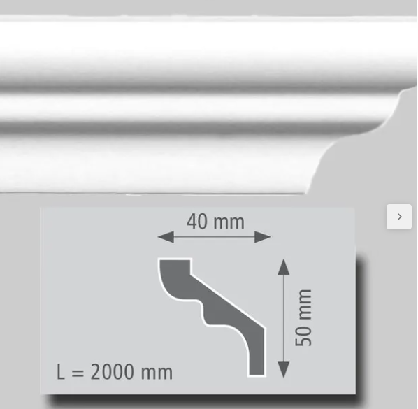
  - __o material do tecto e da sanca deve ser ambientalmente seguro, sem emissoes de gases nocivos, pode ser__:
    - __poliestireno desde que tenha certificacao "Livre de CFC" e de solventes__
- reentrancia no tecto falso junto da janela para colocacao de suporte de cortinados escondido. Exemplo:
  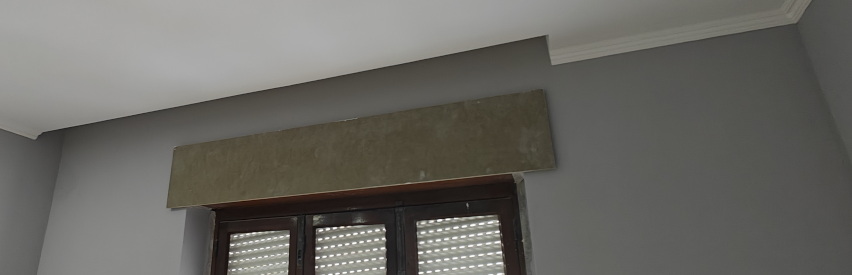
- rodape: 
  - [exemplo](https://www.leroymerlin.pt/produtos/rodape-200x6x1-3-cm-homestar-cf11-17098746.html):

    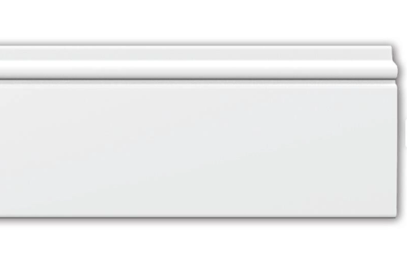
    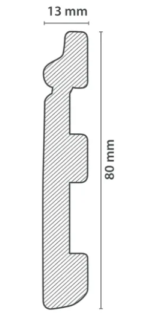
  - __o material deve ser ambientalmente seguro, sem emissoes de gases nocivos, pode ser__:
    - __poliestireno desde que tenha certificacao "Livre de CFC" e de solventes__
    - __composto de madeira e polimero: desde que utilize polimeros virgens ou reciclados de grau alimentar (PE ou PP), que são inertes e seguros__
- isolamento termico (roofmate) do tecto
- isolamento termico (roofmate) da parede onde se encontra a janela
- ar condicionado:
  - sistema split inverter - unidade interior (7-9 k btu) e respectiva unidade exterior
  - colocacao das unidades exteriores:
    - 1a sugestao

      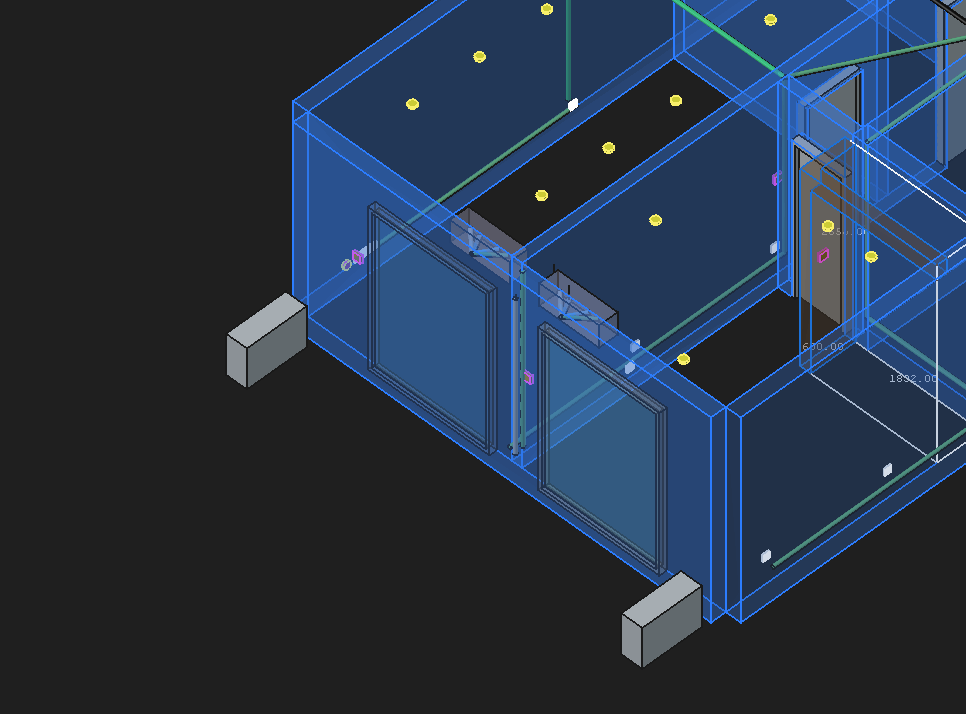
    - 2a sugestao

      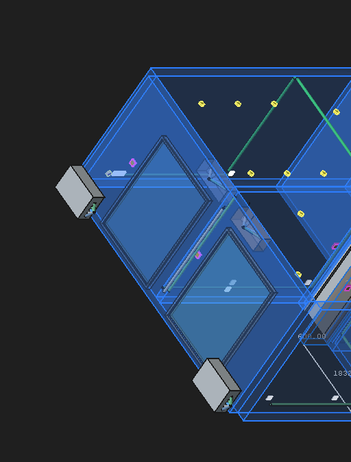


- todas as ligacoes electricas e eventuais tubagens devem passar, na medida do possivel, pelo tecto falso
- luzes led no tecto - devem ter uma estetica discreta

  exemplo:
  
    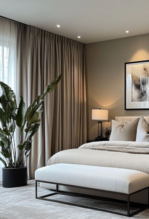
- localizacao em altura de tomadas e interruptores deve ser a comummente usada hoje em dia noutras obras (30cm: tomadas, 1m: interruptores, ...)
- material electrico
  - interruptores e tomadas, [exemplo](https://www.leroymerlin.pt/produtos/eletricidade-e-smart-home/interruptores-e-tomadas/series-de-interruptores-e-tomadas/serie-logus/):
  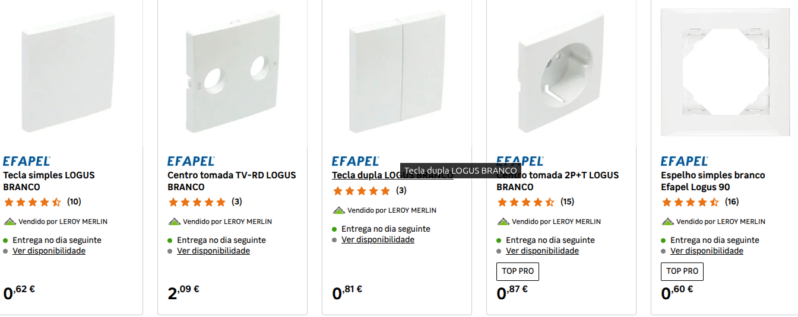

- afagamento e envernizamento do chao de madeira
  - __o verniz deve ser de base aquosa, satinado com proteccao UV, preferencialmente bicomponente (2K), com certificação EC1 Plus ou Greenguard Gold, que prove ter emissoes muito baixas (ha vernizes da marca Cin/Artilin com estas definicoes)__
- pintura de paredes e tecto


## quarto de dormir
- esquema geral

  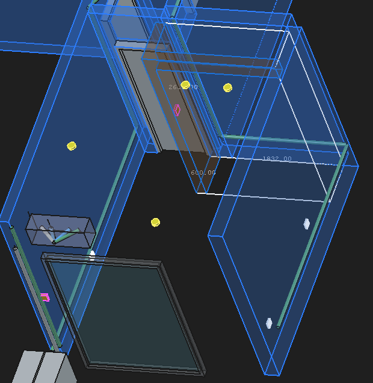
- esquema de topo

  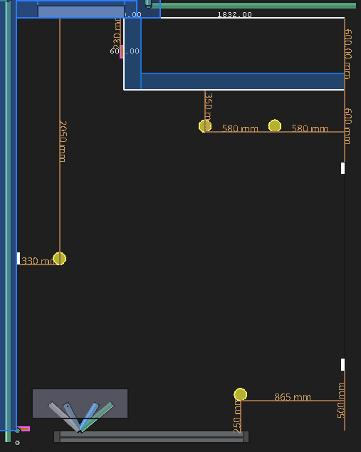

    - legenda:
      - amarelo: leds (4)
      - branco: tomadas (3)
      - rosa: interruptores (2)

- iluminacao tecto em leds
  - junto ao roupeiro (2): focos de recuo/angulo 60 (2/3 cm para dentro), temperatura 3000k, diametro 8cm, 7W, Índice de Reprodução de Cor (CRI) > 90
  - outros (2): cama: 2x focos de recuo/angulo 60 (2/3 cm para dentro), temperatura 2700k, diametro 8cm, 5W

- armario
  - levantamento de parede para armario (espessura 140 mm) a toda a altura do pe direito ate ao tecto falso com barra solida horizontal no topo (a azul e rebordo branco no esquema acima)
    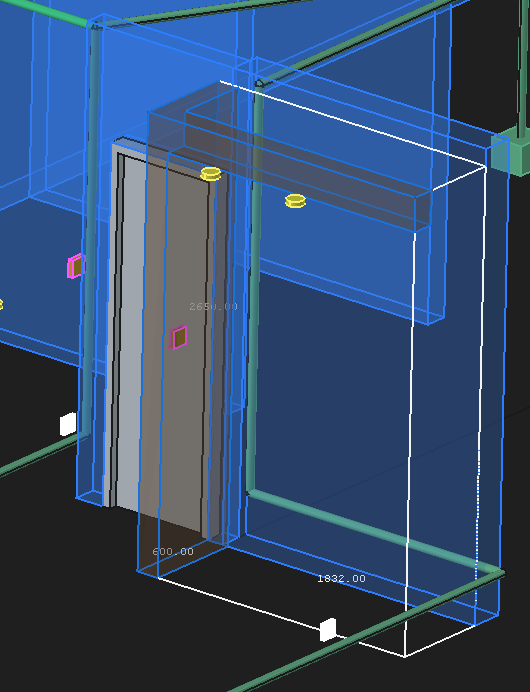
  - montagem de armario de 2 portas, em madeira, esquema exemplo:
  
    ```
    <----------------------- 180 cm (Total) ----------------------------->
                                                                    
    +---------------------------------+----------------------------------+  ^
    |                                 |                                  |  |
    |            MALEIRO              |            MALEIRO               |  | ~45cm
    | (Malas, Edredões, Sazonal)      | (Caixas de arrumação)            |  |
    |                                 |                                  |  v
    +-------------------+-------------+-------------------------+--------+  ^
    |                   |             |                         |        |  |
    |  VARÃO SUPERIOR   |             |       PRATELEIRAS       | PRAT.  |  |
    |      (45cm)       |             |       AJUSTÁVEIS        | AJUST. |  |
    | (Camisas/Blusas)  |             |       (Roupa            |        |  |
    |                   |             |        Dobrada)         |        |  |
    |                   |             |                         |        |  |
    +-------------------+ VARÃO LONGO +-------------------------+--------+  |
    |                   |    (45cm)   |                         |        |  | ~150cm
    |  VARÃO INFERIOR   | (Sobretudos,|       GAVETAS (2)       | GAVETAS|  |
    |      (45cm)       |  Vestidos)  |                         |  (2)   |  |
    | (Calças/Saias)    |             | (Roupa Interior, Meias, |        |  |
    |                   |             |Acessórios)              |        |  |
    |                   |             |         (60cm)          | (30cm) |  |
    +-------------------+-------------+-------------------------+--------+  v
    |                                 |                                  |  |
    |            GAVETA de REDE       |            GAVETA              	 |  | ~45cm
    |           (Sapatos)             |           (Arrumacao/Outros)     |  |
    |                                 |                                  |  |
    +---------------------------------+----------------------------------+  v
                                                                                                                                          
    <--------------------------------> <--------------------------------->
            VÃO ESQUERDO (90cm)              VÃO DIREITO (90cm)
            (Zona de Pendurar)               (Zona de Arrumação)
    ```
  - __notas a discutir__:

    - temos de dar 10cm de profundidade ao sistema de portas de correr, o que vai fazer recuar o espaco interior do armario para uma profundidade de 50cm
    - sera melhor criar uma barra inferior/rodape de armario, de parede, para servir de base onde colocar os sistema de calhas para que as portas nao batam nos pes? e o sistema de calhas para as portas vai estar ligado ao topo e a base do roupeiro? ou so ao topo?
    - as portas com esta altura vao ser pesadas, e podem empenar com o tempo, vi sugestoes de sistemas de calha superior com amortecimento (soft-close) em que os painéis das portas têm tensores internos ou perfis laterais de alumínio robustos.
  - exemplo (aproximado - so encontrei com 3 portas):
    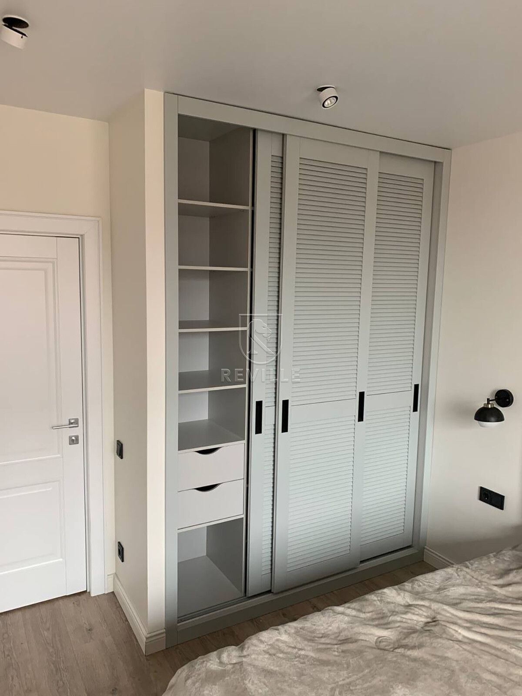


## quarto de escritorio
- esquema geral

  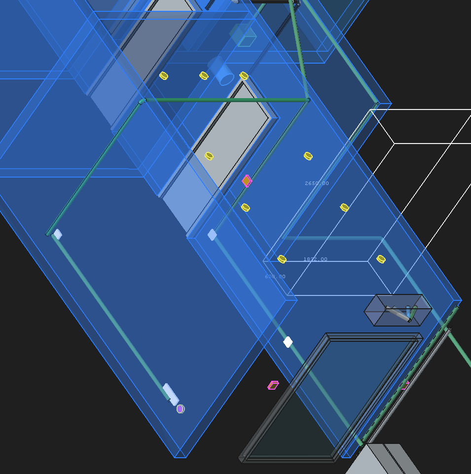

- esquema de topo

  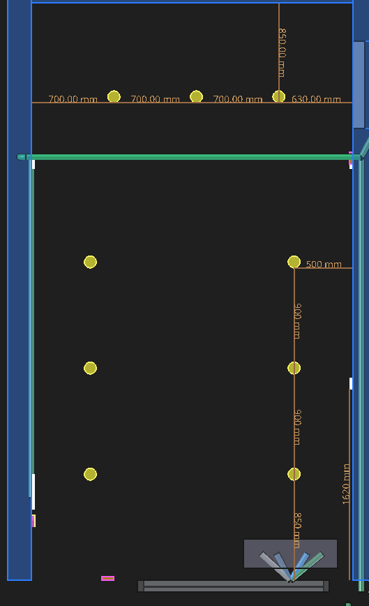

    - legenda:
      - amarelo: leds (9)
      - branco: tomadas (6)
      - rosa+amarelo: rj45 (1)
      - rosa: interruptores (2)

- iluminacao tecto em leds
  - junto a estante (3): focos de recuo/angulo 60 (2/3 cm para dentro), temperatura 2700k, diametro 8cm, 5W
  - junto as paredes (6): focos orientaveis de recuo/angulo 45 (2/3 cm para dentro), temperatura 3000k, diametro 8cm, 5W, Índice de Reprodução de Cor (CRI) > 90


## trabalhos dependentes

- redimensionamento do quadro electrico em consequencia das novas ligacoes (e a prever obras futuras)


